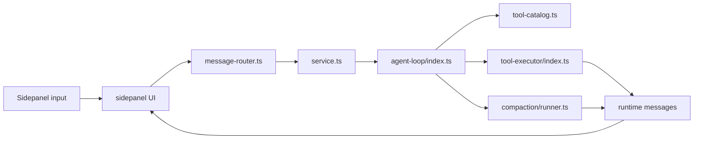

# Agent pipeline

## Runtime path

## Ownership map

| Layer | Files | Job |
| --- | --- | --- |
| UI | `sidepanel/panel.ts`, `ui/core/panel-core.ts`, `ui/core/panel-ui.ts`, `ui/core/{event-handlers,message-handlers}/` | render chat, hold session state, consume runtime events |
| Message bridge | `background/message-router.ts`, `background/service.ts` | route sidepanel requests into runtime services |
| Agent loop | `background/agent/agent-loop/`, `background/agent/compaction/` | prepare history, run model pass, normalize responses, compact context |
| Tools | `background/tools/tool-catalog.ts`, `background/tools/tool-executor/`, `background/tools/orchestrator/`, `background/tools/subagent/`, `packages/extension/tools/` | expose and execute browser tools |
| Shared contract | `packages/shared/src/runtime-message-*.ts` | define runtime event shapes across UI/background/relay |

## State that matters

These structures are the first places to inspect for leaks or drift:

| State | Why it exists | Guardrail |
| --- | --- | --- |
| `displayHistory` | UI transcript | capped separately from model context |
| `contextHistory` | model-facing transcript | clamped through `panel-session-memory.ts` |
| `historyTurnMap` | rich turn/tool trace | bounded turn and per-turn event caps |
| `toolCallViews` | tool timeline DOM/view state | capped count + explicit cleanup |
| `reportImages` | screenshot/report cache | count/byte caps + blob cleanup + fallback eviction |

## Where to debug

1. **UI looks wrong** → `sidepanel/ui/*`
2. **Runtime event mismatch** → `runtime-message-definitions.ts`, `message-router.ts`, `ui/core/message-handlers/`, `ui/core/panel-core.ts`
3. **Tool missing/blocked** → `tool-catalog.ts`, `tool-permissions.ts`, `background/tools/tool-executor/`
4. **Context/compaction issue** → `panel-context.ts`, `panel-session-memory.ts`, `background/agent/compaction/`
5. **Perf issue** → run `npm run perf:tabs` and use [`tab-process-performance-playbook.md`](./tab-process-performance-playbook.md)

## Adjacent surfaces

- Relay: `packages/relay-service/`, `packages/cli/`
- Electron agent: `packages/electron-agent/`

They reuse the same shared contracts and sit beside the extension runtime, not above it.
