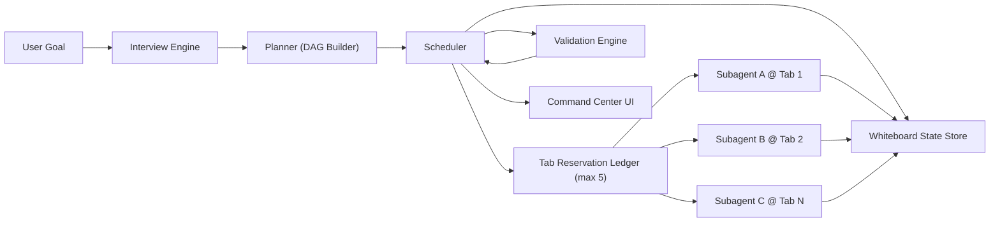
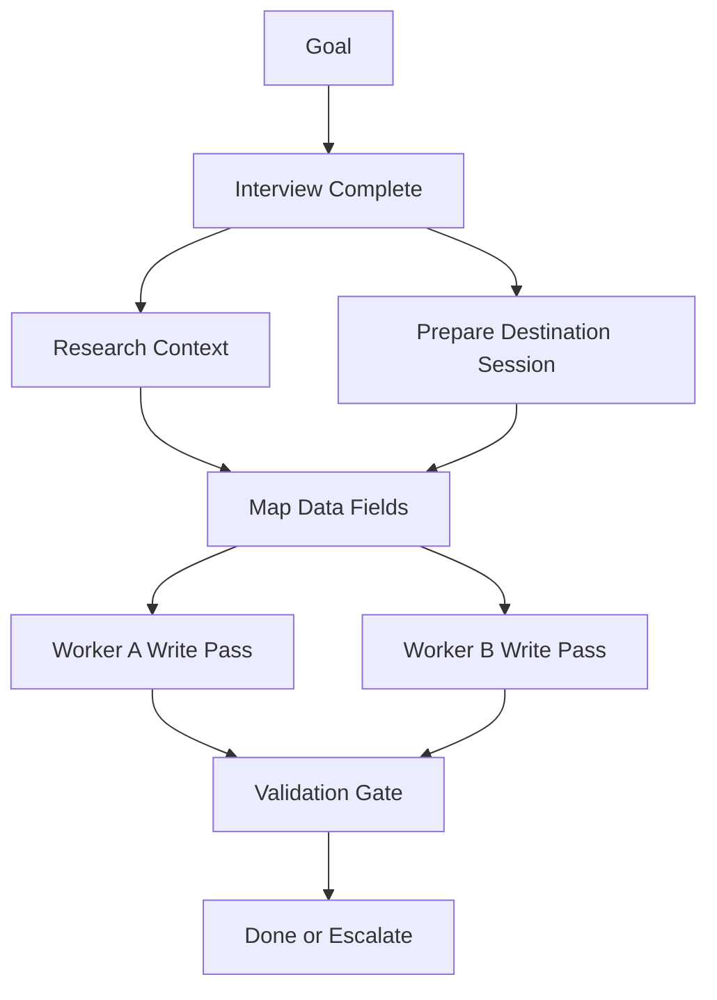
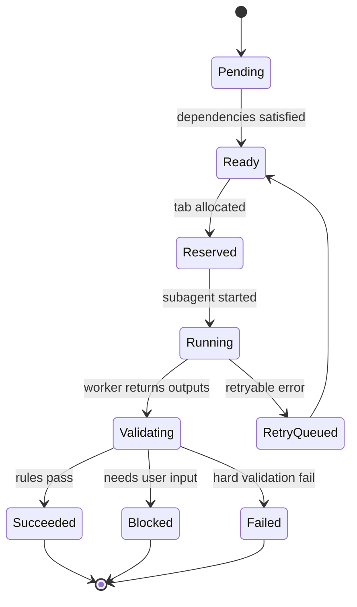
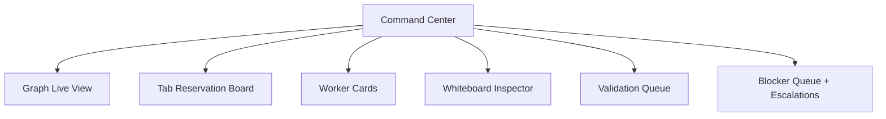
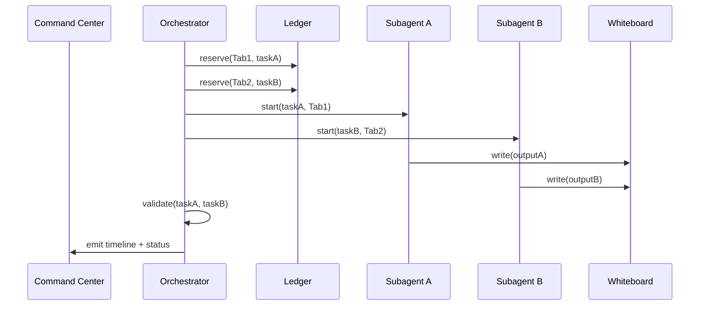
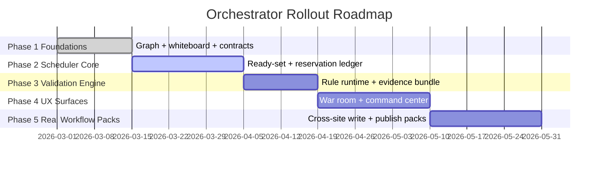

# Master Specification: 5-Tab Autonomous Orchestrator

> Version: 1.0 (North Star Spec)  
> Scope: Browser-AI extension orchestrator control plane + tab-bound worker plane  
> Hard limit: 5 concurrent session tabs

---

## Table of Contents
1. [Purpose and Product Promise](#1-purpose-and-product-promise)
2. [System Boundaries and Non-Goals](#2-system-boundaries-and-non-goals)
3. [Core Architecture](#3-core-architecture)
4. [User Interview Framework](#4-user-interview-framework)
5. [Planning Graph Model](#5-planning-graph-model)
6. [Dependency Sequencing Model](#6-dependency-sequencing-model)
7. [Validation Model](#7-validation-model)
8. [UX Spec: War Room + Command Center](#8-ux-spec-war-room--command-center)
9. [Data Model](#9-data-model)
10. [Real Test Suite Strategy](#10-real-test-suite-strategy)
11. [Observability + Operational Telemetry](#11-observability--operational-telemetry)
12. [Rollout Phases](#12-rollout-phases)
13. [Concrete First Case: Cross-Site Simultaneous Write](#13-concrete-first-case-cross-site-simultaneous-write)
14. [Task Trees](#14-task-trees)
15. [Definition of Done](#15-definition-of-done)

---

## 1. Purpose and Product Promise

The orchestrator is a **goal execution control plane** that can:
- interview the user for missing requirements,
- build a dependency-aware execution graph,
- schedule work across up to 5 tabs,
- delegate tasks to subagents with explicit tab ownership,
- maintain shared state (whiteboard),
- validate outcomes with evidence,
- escalate only when required.

This is not a single-agent macro runner. This is multi-worker, stateful, validated orchestration.

---

## 2. System Boundaries and Non-Goals

### In scope
- 5-tab bounded orchestration runtime
- graph planning + dependency sequencing
- two-plane architecture (orchestrator + workers)
- structured whiteboard state
- deterministic validation contracts
- operator-facing war-room and command-center UX

### Out of scope (v1)
- unlimited tab scaling
- unbounded autonomous retries without policy
- full live-stream video from every tab
- hidden autonomous publish actions without approval checkpoints

---

## 3. Core Architecture



### Planes
- **Control plane:** interview, plan, sequence, reserve, validate, escalate.
- **Worker plane:** execute bounded task in one reserved tab and emit structured outputs.

### Hard runtime constraints
- Max 5 concurrent reserved tabs.
- Each running task owns exactly one tab.
- Workers cannot steal each other’s tabs.

---

## 4. User Interview Framework

Interview runs before execution and produces a machine-usable contract.

### 4.1 Interview stages
1. **Goal normalization** — what result must exist at end?
2. **Constraint elicitation** — deadlines, policy, approval gates.
3. **Credential/access check** — site auth state and missing accounts.
4. **Input inventory** — assets and data already available vs missing.
5. **Risk capture** — likely blockers and fallback preferences.
6. **Approval summary** — user confirms or edits assumptions.

### 4.2 Question taxonomy
- **Required:** missing answers block plan finalization.
- **Optional:** improves quality only.
- **Policy-critical:** controls safety and user approvals.
- **Ambiguity-breakers:** disambiguate overloaded intents.

### 4.3 Interview output schema
```ts
interface InterviewResult {
  resolvedInputs: Record<string, unknown>;
  missingRequiredInputs: string[];
  assumptions: string[];
  constraints: {
    deadline?: string;
    allowedSites: string[];
    requiresHumanApprovalAt: string[];
  };
  riskFlags: string[];
  readyToPlan: boolean;
}
```

---

## 5. Planning Graph Model

Planner output is a DAG where nodes are executable tasks with explicit contracts.



### Node contract
Each node defines:
- dependencies,
- allowed tools,
- target site patterns,
- assigned profile,
- required whiteboard inputs,
- expected whiteboard outputs,
- validation rules,
- failure class.

---

## 6. Dependency Sequencing Model

### 6.1 Sequencing rules
1. Node is **ready** only if all hard dependencies are terminal-success.
2. Soft-fail dependencies may unlock with degraded mode if policy allows.
3. Scheduler computes ready set per tick.
4. Ready nodes compete for tab reservations.
5. No reservation, no dispatch.

### 6.2 Priority order
1. unblock critical path,
2. preserve authenticated tab reuse,
3. minimize cross-site context switching,
4. maximize parallelism up to tab cap.

### 6.3 Lifecycle


---

## 7. Validation Model

Validation is contract-based, not LLM self-assertion.

### 7.1 Validation layers
- **Task-level validation:** local postconditions for a node.
- **Dependency-edge validation:** required outputs exist before downstream unlock.
- **Goal-level validation:** final objective evidence is present.

### 7.2 Validation rule types
- URL pattern reached
- DOM selector/text assertion
- file upload acceptance
- whiteboard key existence + schema
- cross-site data consistency check
- explicit human confirmation checkpoint

### 7.3 Evidence bundle
Every terminal node emits:
- `summary`
- `screenshotRefs[]`
- `toolEvents[]`
- `whiteboardDiff`
- `validationResults[]`

---

## 8. UX Spec: War Room + Command Center

### 8.1 Pre-execution War Room
Purpose: approve plan before runtime side-effects.

Panels:
- Interview summary
- Assumptions + risks
- DAG preview
- Tab demand forecast
- Approval checkpoints
- “Run / Edit / Cancel” controls

### 8.2 Live Command Center
Purpose: control and audit execution in real time.



### 8.3 Required operator actions
- pause/resume scheduler
- retry specific node
- force revalidation
- reassign profile/tab
- inject user answer into blocked node

---

## 9. Data Model

```ts
type TaskStatus =
  | 'pending'
  | 'ready'
  | 'reserved'
  | 'running'
  | 'validating'
  | 'succeeded'
  | 'blocked'
  | 'failed'
  | 'canceled';

interface OrchestratorPlan {
  id: string;
  goal: string;
  maxConcurrentTabs: number; // <= 5
  interview: InterviewResult;
  tasks: OrchestratorTaskNode[];
  whiteboardSchema: WhiteboardSchema;
  policies: OrchestratorPolicy;
}

interface OrchestratorTaskNode {
  id: string;
  title: string;
  dependencies: string[];
  softDependencies?: string[];
  targetSites: string[];
  assignedProfile?: string;
  assignedTabId?: number;
  inputs: WhiteboardBinding[];
  outputs: WhiteboardBinding[];
  validations: ValidationRule[];
  retryPolicy: RetryPolicy;
  status: TaskStatus;
}

interface WhiteboardEntry<T = unknown> {
  key: string;
  value: T;
  producerTaskId: string;
  updatedAt: string;
  schemaVersion: string;
}

interface TimelineEvent {
  runId: string;
  taskId?: string;
  tabId?: number;
  subagentId?: string;
  type: string;
  at: string;
  payload: Record<string, unknown>;
}
```

---

## 10. Real Test Suite Strategy

Use real-browser integration where orchestration behavior matters.

### 10.1 Test pyramid (orchestration-first)
1. **Unit** — graph normalization, ready-set derivation, retry classification.
2. **Integration** — scheduler + ledger + whiteboard with deterministic stubs.
3. **E2E (mock web sandbox)** — multi-tab browser flows with DOM assertions.
4. **Canary live-site probes** — small, non-destructive periodic checks.

### 10.2 Required suites
- `planner.spec.ts`: DAG validity, ambiguity handling, interview gate checks
- `scheduler.spec.ts`: dependency unlock, reservation fairness, cancellation
- `worker-contract.spec.ts`: tab pinning, tool guardrails, output contracts
- `validation-engine.spec.ts`: rule execution and evidence integrity
- `flows/cross-site-write.spec.ts`: first-case full execution path

### 10.3 Artifact policy
All integration/E2E runs must dump:
- `test-output/orchestrator/<runId>/timeline.json`
- `test-output/orchestrator/<runId>/whiteboard-final.json`
- `test-output/orchestrator/<runId>/screenshots/*.png`

---

## 11. Observability + Operational Telemetry

### 11.1 Event stream contract


### 11.2 Minimum telemetry dimensions
- runId, taskId, tabId, subagentId
- profile, site, tool, latency
- retryCount, blockerType, validationOutcome

### 11.3 SLOs (initial)
- scheduler tick p95 < 500ms
- node dispatch-to-first-action p95 < 2s
- validation completion p95 < 1s after worker return
- run replay completeness = 100% (no missing critical events)

---

## 12. Rollout Phases



### Exit criteria per phase
- **P1:** plan + whiteboard types stable and versioned
- **P2:** deterministic scheduler with pause/resume/retry
- **P3:** validation failures produce actionable blockers
- **P4:** operator can control run without logs spelunking
- **P5:** first-case workflow passes E2E with artifacts

---

## 13. Concrete First Case: Cross-Site Simultaneous Write

### Scenario statement
**“One site writes into another site at the same time with 2 subagents and 1 orchestrator.”**

### 13.1 Real example
- **Source site:** Airtable (records to sync)
- **Destination site:** Notion (pages/database rows)
- **Direction:** bi-directional sync window
- **Agents:**
  - Subagent A (Tab 1): Airtable ➜ Notion write path
  - Subagent B (Tab 2): Notion ➜ Airtable write-back path
  - Orchestrator: dependency control, conflict detection, validation

### 13.2 Execution design
1. Interview: confirm field mappings + conflict policy + authoritative source per field.
2. Planner: build graph with mapping, write pass A, write pass B, reconcile, validate.
3. Scheduler: reserve Tab 1 and Tab 2 simultaneously.
4. Workers: execute writes in parallel with idempotency keys.
5. Validation: compare both systems by checksum on synced records.
6. Escalate: if conflicts exceed threshold or required fields mismatch.

### 13.3 Concurrency + conflict policy
- Last-write-wins forbidden for critical fields.
- Conflict classes: `nonCritical`, `critical`, `schemaMismatch`.
- Critical conflicts route to human approval node.

### 13.4 Success contract
Run is successful only if:
- both write passes succeed,
- reconciliation node reports zero critical conflicts,
- both sites contain agreed canonical values,
- evidence bundle includes screenshots + record IDs + whiteboard diff.

### 13.5 Secondary exemplar: YouTube publish pipeline (parallel branches)
- Tab 1: download final export from Riverside
- Tab 2: trend and search-term research
- Tab 3: thumbnail generation flow
- Tab 4: upload + metadata + thumbnail in YouTube Studio
- Tab 5: reserved for fallback/auth/manual intervention

The same orchestration mechanics apply: whiteboard handoff, dependency gates,
parallel workers, and validation before final publish state.

---

## 14. Task Trees

### 14.1 Master task tree
```text
Orchestrator Program
├── Interview Framework
│   ├── Goal normalization
│   ├── Constraint collection
│   ├── Auth/access verification
│   └── Approval summary
├── Planning Graph
│   ├── Node contract generation
│   ├── Dependency graph build
│   └── Whiteboard schema derivation
├── Scheduler
│   ├── Ready-set computation
│   ├── Tab reservation ledger
│   ├── Dispatch loop
│   └── Retry/cancel policies
├── Validation
│   ├── Rule engine
│   ├── Evidence bundling
│   └── Goal-level verdict
├── UX
│   ├── War room
│   ├── Command center
│   └── Blocker escalation UI
├── Testing
│   ├── Unit/integration suites
│   ├── Mock-web E2E
│   └── Canary live probes
└── Observability
    ├── Timeline event schema
    ├── Metrics + traces
    └── Replay tooling
```

### 14.2 First-case task tree (Airtable ↔ Notion)
```text
Cross-Site Simultaneous Write Run
├── Interview
│   ├── Confirm source/destination auth
│   ├── Confirm field mappings
│   └── Confirm conflict policy
├── Plan
│   ├── Build bi-directional write DAG
│   └── Define reconciliation/validation nodes
├── Execute Parallel Writes
│   ├── Subagent A: Airtable -> Notion
│   └── Subagent B: Notion -> Airtable
├── Reconcile
│   ├── Compute record checksums
│   └── Classify conflicts
└── Validate + Finish
    ├── Assert critical conflict count == 0
    ├── Persist artifacts
    └── Return final run summary
```

---

## 15. Definition of Done

This specification is considered implemented when:
1. 5-tab bounded scheduler is operational,
2. graph-based orchestration replaces checklist-only execution for orchestrated mode,
3. validation contracts gate task completion,
4. war-room and command-center UX are usable,
5. first-case cross-site simultaneous write passes E2E with reproducible artifacts.
