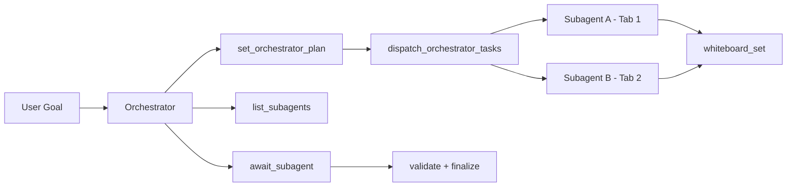

# 04 — Multitab Orchestrator Implementation + Validation Report

**Date:** March 7, 2026  
**Branch:** `feat/multitab-orchestrator-v1`  
**PR:** https://github.com/0xSero/parchi/pull/22

---

## 1) What this documents

This report captures what was implemented for the multitab orchestrator runtime, what was tested, and how to use the new orchestration primitives.

---

## 2) Delivered runtime capabilities

### 2.1 Async subagent orchestration (up to 5 concurrent workers)

Implemented in `packages/extension/background/service.ts`:

- `spawn_subagent({ mode: "async", ... })`
- session-level tab lease safety for pinned workers
- running worker cap: **5**
- subagent state tracking (`running/completed/failed/cancelled`)
- `list_subagents`
- `await_subagent`

### 2.2 Graph-level orchestrator tools

Implemented in `packages/extension/background/service.ts`:

- `set_orchestrator_plan`
- `get_orchestrator_plan`
- `update_orchestrator_task`
- `dispatch_orchestrator_tasks`

These tools let the orchestrator own a DAG-style plan and dispatch ready nodes to async subagents.

### 2.3 Shared graph utility additions

Implemented in `packages/shared/src/orchestrator.ts`:

- `getDispatchableOrchestratorTaskIds(...)`
- `getOrchestratorPlanValidationIssues(...)`

### 2.4 Prompt/system guidance updates

Implemented in `packages/shared/src/prompts.ts` and orchestrator system-prompt section:

- explicit graph-tool guidance
- explicit async dispatch + await guidance
- whiteboard-first shared-memory workflow guidance

---

## 3) Master spec documentation delivered

Replaced/expanded orchestrator strategy doc:

- `docs/reports/03-autonomous-orchestrator-north-star.md`

It now includes:
- interview framework
- planning graph and sequencing model
- validation model
- UX (war room + command center)
- observability + rollout phases
- concrete 2-subagent/1-orchestrator cross-site parallel write case

---

## 4) Execution model (now supported)

---

## 5) Test and evidence status

### 5.1 Automated test gates

All passed on March 7, 2026:

- `npm run typecheck` ✅
- `npm run test:unit` ✅ (42 passed)
- `npm run test:e2e` ✅ (all passing)
- `npm run check:repo-standards` ✅

### 5.2 Deterministic artifacts

- `test-output/orchestrator-simulated-run.json`
- `test-output/orchestrator-typecheck.log`
- `test-output/orchestrator-test-unit.log`
- `test-output/orchestrator-test-e2e.log`
- `test-output/orchestrator-repo-standards.log`

---

## 6) Minimal operator flow example

1. Call `set_orchestrator_plan` with goal/tasks/dependencies.  
2. Call `get_orchestrator_plan` and verify no validation issues.  
3. Call `dispatch_orchestrator_tasks` to start ready nodes asynchronously.  
4. Monitor with `list_subagents`.  
5. Join with `await_subagent`.  
6. Validate whiteboard outputs and finalize.

---

## 7) Workflow fixture pack

Added reusable orchestrator plan fixtures:

- `tests/fixtures/orchestrator/cross-site-write-plan.json`
- `tests/fixtures/orchestrator/youtube-publish-plan.json`
- `tests/fixtures/orchestrator/system-validation-criteria.json`

Fixture validation artifact:

- `test-output/orchestrator-fixture-validation.json`
- `test-output/orchestrator-fixture-execution.json`
- `test-output/orchestrator-criteria-matrix.json`
- `test-output/orchestrator-criteria-matrix.md`

Fixture executor path now exists in tests:

- `tests/orchestrator/fixture-executor.ts`
- `tests/orchestrator/run-fixture-executor.ts`

Executor loop:

1. set plan (`buildOrchestratorPlan`)
2. dispatch ready tasks (`getDispatchableOrchestratorTaskIds`)
3. await simulated subagents
4. validate required outputs and export summary artifact

Run command:

- `npm run test:orchestrator`

---

## 8) Commits included

- `1f969fa` — async subagent control + tab leases + await/list tools
- `fdbd1b6` — E2E harness alignment to current runtime/UI contracts
- `a4a9bb5` — master 5-tab north-star specification
- `da73c42` — graph plan management + ready-task dispatcher tools

---

## 9) Next concrete step

Extend fixture executor from simulation into background-service integration harness that calls runtime tool handlers directly for end-to-end orchestration contract checks.
